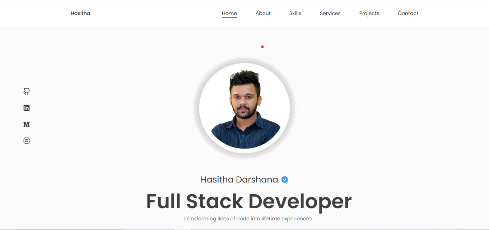

# Personal Portfolio Website

A responsive and interactive portfolio built with React.js and custom CSS. Showcases my skills, projects, and achievements as a full-stack developer. Designed to highlight my experience, technical expertise, and passion for building modern web applications.

https://hamdhasitha.me/

## Features

- **Interactive UI**: Smooth navigation across sections with a modern, clean design.
- **Personal Details**: Section highlighting my background, experience, and skillset.
- **Projects Portfolio**: Showcasing development projects and photography work.
- **Contact Form**: For easy communication and inquiries.

## Technologies Used

- **React.js**: For building the user interface and handling the application’s state.
- **CSS**: Used for styling the website and creating responsive designs.
- **HTML**: For the structure of the website.

